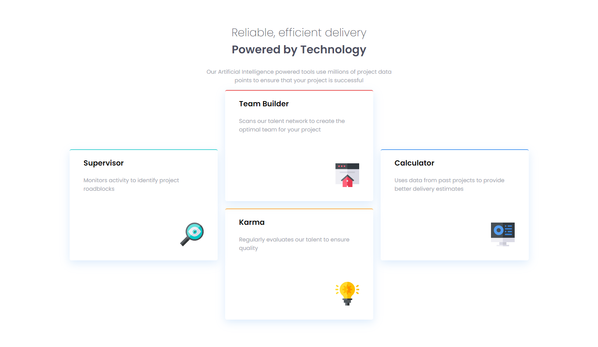
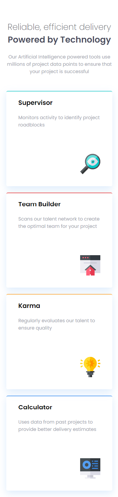

# Four Card Feature Section

## Overview

This project showcases a "Four Card Feature Section," designed to present different aspects of a service or product, namely its reliability and efficiency, through a clean and modern UI. Built using HTML and CSS, it incorporates the Poppins font from Google Fonts to ensure a sleek and readable typography experience. Each card highlights a unique feature or offering, making it an ideal layout for businesses looking to clearly display their strengths or services.

## Features

- **Responsive Layout:** Crafted to look great on any device, ensuring that your content is accessible to all users.
- **Custom Typography:** Utilizes 'Poppins' from Google Fonts, offering a clean and modern presentation of information.
- **Feature Highlights:** Four distinct cards (Supervisor, Team Builder, Karma, Calculator) to describe different services or product features effectively.

## Screenshots





## Setup

To use this component in your project, follow these steps:

1. **Clone the Repository:**

```bash
git clone https://github.com/Wilmer856/four-card-feature-section.git
```

2. **Navigate to the Project Directory:**

```bash
cd four-card-feature-section-master
```

3. **Open the `index.html` file in a web browser to view the component.**

## Customization

- **Content:** Modify the headings and descriptions in each card to match the specific features or services you want to highlight.
- **Images:** Replace the images in the images directory with icons that best represent your features for a more customized look.
- **Styling:** Adjust the styles.css file to match your branding, such as colors and font sizes.

## Dependencies

- Google Fonts: [Poppins](https://fonts.google.com/specimen/Poppins) for typography.
